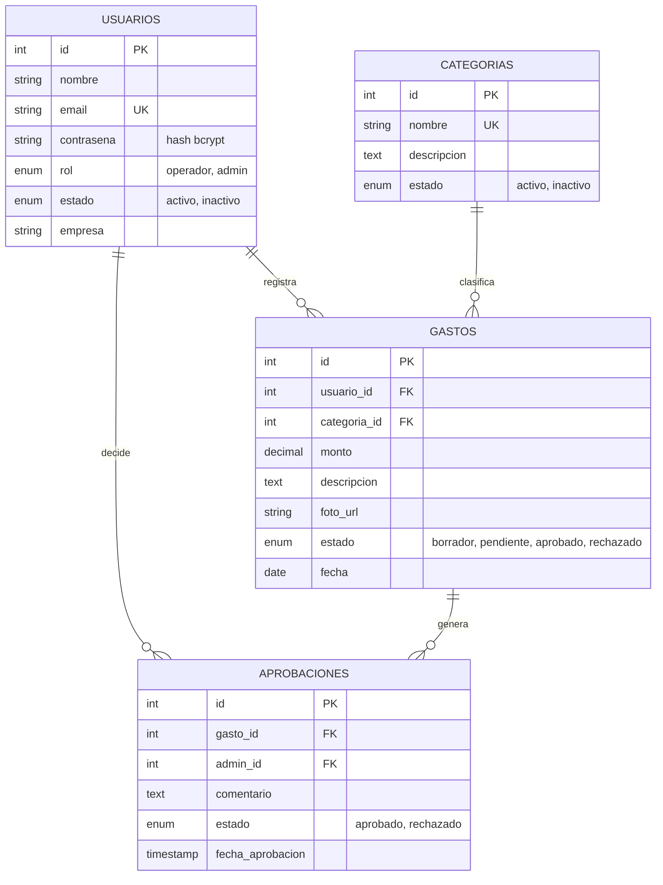

# SideBSide — Avances del Backend

Documento de apoyo para presentar el progreso del backend de SideBSide (control de gastos operativos). Universidad Anáhuac Mayab — curso tecniA.

---

## 1. Qué es SideBSide

Plataforma para registrar, controlar y facilitar el reembolso de gastos operativos de empleados en campo (combustible, comida, peajes, mantenimiento, etc.). Cliente piloto de validación en los documentos de referencia: **Transportes Falcon**.

Flujo central: un **operador** registra un gasto (con foto del comprobante) → lo envía a revisión → un **admin** lo aprueba o rechaza → queda historial de la decisión.

## 2. Stack

- **Backend**: Node.js + Express
- **Base de datos**: MySQL
- **Auth**: JWT (JSON Web Tokens) + contraseñas hasheadas con bcrypt
- **Subida de archivos**: Multer (fotos de comprobantes)
- **Pruebas**: colección de Postman con scripts automatizados

Frontend (React) todavía no se ha empezado — lo único que existe hoy es el backend (API) y sus pruebas.

## 3. Modelo de datos

4 tablas en la base `sidebside`:

Categorías precargadas: Combustible, Comida, Peaje, Mantenimiento, Viaticos, Materiales, Otro.

## 4. Endpoints implementados

### Autenticación (`/api/auth`)
| Método | Ruta | Quién | Qué hace |
|---|---|---|---|
| POST | `/login` | público | Login, regresa JWT |
| POST | `/register` | admin | Crea un nuevo usuario (operador o admin) |
| PUT | `/cambiar-contrasena` | autenticado | Cambia su propia contraseña |
| POST | `/logout` | autenticado | Cierra sesión (formalidad, JWT es stateless) |

### Categorías (`/api/categorias`)
| Método | Ruta | Quién | Qué hace |
|---|---|---|---|
| GET | `/` | autenticado | Lista categorías |
| POST | `/` | admin | Crea categoría |
| PUT | `/:id` | admin | Edita categoría |

### Gastos (`/api/gastos`)
| Método | Ruta | Quién | Qué hace |
|---|---|---|---|
| POST | `/` | operador/admin | Crea gasto (borrador o enviado a revisión) |
| GET | `/` | autenticado | Lista gastos (operador solo ve los suyos; admin filtra por estado/categoría/fecha/usuario) |
| GET | `/:id` | dueño o admin | Detalle de un gasto |
| PUT | `/:id` | dueño | Edita un gasto (solo si está en borrador/pendiente) |
| DELETE | `/:id` | dueño | Elimina un gasto (solo si está en borrador/pendiente) |
| POST | `/:id/comprobante` | dueño | Sube la foto del comprobante |
| GET | `/pendientes` | admin | Lista gastos esperando revisión |
| PUT | `/:id/aprobar` | admin | Aprueba un gasto pendiente |
| PUT | `/:id/rechazar` | admin | Rechaza un gasto pendiente (requiere comentario) |

### Reportes (`/api/reportes`, todos admin)
| Método | Ruta | Qué hace |
|---|---|---|
| GET | `/totales` | Suma total de gastos |
| GET | `/por-categoria` | Desglose por categoría |
| GET | `/por-empleado` | Desglose por empleado |
| GET | `/` | Reporte general |

## 5. Decisiones y desviaciones respecto a la guía original

La guía de referencia (`ReferenciasC/`) dejaba algunos puntos ambiguos o desactualizados. Estas son las decisiones que tomamos y por qué:

- **`gastos.categoria` → `categoria_id` (FK)**: la guía original la definía como texto libre; se cambió a llave foránea contra `categorias` para mantener integridad referencial (evita categorías mal escritas o inconsistentes).
- **Estado `'borrador'` agregado a `gastos.estado`**: la guía de Base de Datos no lo incluía, pero el documento de Requerimientos (RF2.5) pide poder guardar un gasto sin enviarlo a revisión todavía. Se agregó para resolver esa contradicción entre los dos documentos.
- **`bcryptjs` en vez de `bcrypt`**: incluye una cadena de dependencias con una vulnerabilidad conocida en su build nativo (`tar`/`node-pre-gyp`). `bcryptjs` es JS puro, misma API, cero hallazgos en `npm audit`.
- **`multer@2.x` en vez de `1.x`**: la versión que insinuaba la guía tiene vulnerabilidades conocidas.
- **Fotos de comprobantes en `uploads/` local**, no S3 todavía — la migración a S3 queda para cuando se despliegue a producción en AWS (documentado en el doc de Arquitectura).
- **Registro de usuarios requiere admin autenticado** (RF1.5): no hay registro público. El primer admin se crea una sola vez con un script de línea de comandos (`crearAdmin.js`) porque al arrancar el proyecto no existe ningún admin todavía.
- **Fuera de alcance en esta etapa**: notificaciones in-app (RF7) y exportación real a Excel/PDF — ambas están marcadas como opcionales/futuras en el documento de Requerimientos.

## 6. Cómo se probó

Se armó una **colección de Postman** (`postman/SideBSide.postman_collection.json`) que cubre el flujo completo end-to-end:
1. Login de admin
2. Alta de un operador nuevo
3. Login del operador
4. Creación de categoría
5. Operador crea 3 gastos (uno para aprobar, uno para rechazar, uno en borrador)
6. Operador sube foto de comprobante, edita y borra gastos
7. Admin lista pendientes, aprueba uno, rechaza otro
8. Admin consulta los 4 reportes

Los tokens de sesión e IDs generados se capturan automáticamente entre requests (no hay que copiar/pegar nada a mano) — se corrió toda la colección sin errores.

## 7. Qué falta

- **Frontend en React** — no se ha empezado; solo existe el mockup HTML estático de referencia.
- Despliegue en AWS (RDS + EC2/S3) — hoy corre 100% local.
- Notificaciones in-app y exportación a Excel/PDF (marcadas como opcionales en Requerimientos).
